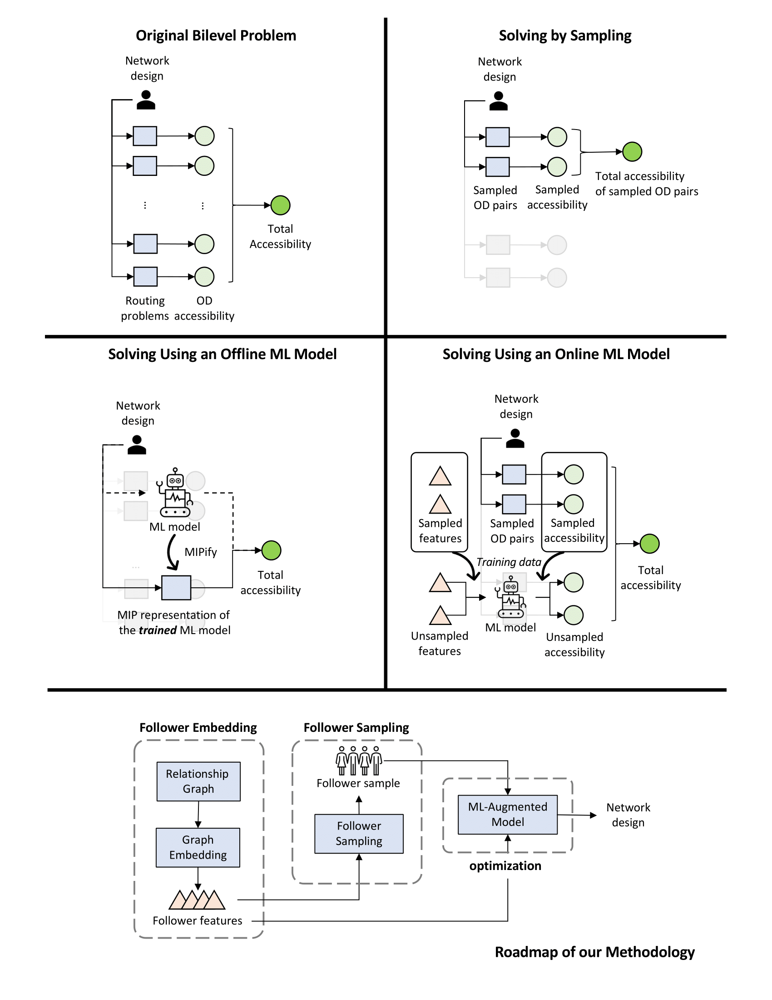

# ML4Bilevel

This is a repository for [A Machine Learning Approach to Solving Large Bilevel and Stochastic Programs: Application to Cycling Network Design](https://arxiv.org/abs/2209.09404).

We present a novel machine learning-based approach to solving bilevel programs that involve a large number of independent followers, which as a special case include two-stage stochastic programming. We propose an optimization model that explicitly considers a sampled subset of followers and exploits a machine learning model to estimate the objective values of unsampled followers. Unlike existing approaches, we embed machine learning model training into the optimization problem, which allows us to employ general follower features that can not be represented using leader decisions. We prove bounds on the optimality gap of the generated leader decision as measured by the original objective function that considers the full follower set. We then develop follower sampling algorithms to tighten the bounds and a representation learning approach to learn follower features, which can be used as inputs to the embedded machine learning model. Using synthetic instances of a cycling network design problem, we compare the computational performance of our approach versus baseline methods. Our approach provides more accurate predictions for follower objective values, and more importantly, generates leader decisions of higher quality. Finally, we perform a real-world case study on cycling infrastructure planning, where we apply our approach to solve a network design problem with over one million followers. Our approach presents favorable performance compared to the current cycling network expansion practices.




## Dependencies
- [Gurobi](https://www.gurobi.com)
- [Numpy](https://numpy.org)
- [Pandas](https://pandas.pydata.org)
- [Scikit Learn](https://scikit-learn.org/stable/)
- [Pytorch](https://pytorch.org)
- [tqdm](https://tqdm.github.io)
- [Scipy](https://scipy.org)
- [Gensim](https://radimrehurek.com/gensim/)

## Synthetic Instances

We provide code to re-produce the computational results on the synthetic instances.

Step 0: To initialize the problem instances, run
```commandline
python solve_synthetic_init.py
```
The code is provided for completeness. You can skip this step. The instances have already been generated and stored in `./prob/6x6-72/`.

Step 1: To generate the computational results, run
```commandline
python solve_synthetic.py --variant linear
```
Here, you can change the variant name to use different accessibility measures (linear, exp, rec, and utility)

## Real Instances

We provide code to re-produce the case-study results. However, important note that the calculation requires weeks to finish. 
You can access the pre-calculated results for the first two steps in `./prob/trt/res/job/precalculated/`.

Step 0: Download data:
- Network instances from [here](https://utoronto-my.sharepoint.com/:u:/g/personal/imbo_lin_mail_utoronto_ca/ER5aFjv_o6NLmkHcgmZbd1kB8OyGxOEDdZiMjNU2TCBS7g?e=dMW3ZY) and [here](https://utoronto-my.sharepoint.com/:u:/g/personal/imbo_lin_mail_utoronto_ca/EXRDjhrFOBZPq5HEExgdJkQBcDzsa4SfognkGR3vRBkUlw?e=f5b1a1), put the two files under `./prob/trt/`
- OD-pair embedding form [here](https://utoronto-my.sharepoint.com/:u:/g/personal/imbo_lin_mail_utoronto_ca/EQQs1jV4WjtImJPgiYrEu_EBNblHcy1FECwaNyLwJNY_zw?e=dWge2g), put the file under `./prob/trt/emb/`

Step 1: To obtain network designs, run
```commandline
python solve_trt_opt_cmd.py \
 -s 21 22 23 24 25 26 27 28 29 30 31 32 33 34 35 36 37 38 39 40 41 \
 -b 40 80 120 160 200 240 280 320 360 400 \
 --n 2000 \
 --potential job  
```

Here we solve the *k*NN-augmented model with 21 different *p*-median samples (each consists of 2000 OD pairs) 
and 10 different budgets (10, 20, ..., 100 km) using destination job count as the potential for accessibility calculation. 


Step 2: To calculate the accessibility of each network design, run
```commandline
python solve_trt_opt_res.py \
 -s 21 22 23 24 25 26 27 28 29 30 31 32 33 34 35 36 37 38 39 40 41 \
 --n 2000 \
 --potential job  
```

Step 3: To generate the shapefile of the network design, run
```commandline
python solve_trt_opt_map.py \
 -s 21 22 23 24 25 26 27 28 29 30 31 32 33 34 35 36 37 38 39 40 41 \
 --n 2000 \
 --budget 400 \
 --potential job  
```

## Citation
```
@article{chan2022machine,
  title={A Machine Learning Approach to Solving Large Bilevel and Stochastic Programs: Application to Cycling Network Design},
  author={Chan, Timothy C. Y. and Lin, Bo and Saxe, Shoshanna},
  journal={arXiv preprint arXiv:2209.09404},
  year={2022}
}
```
